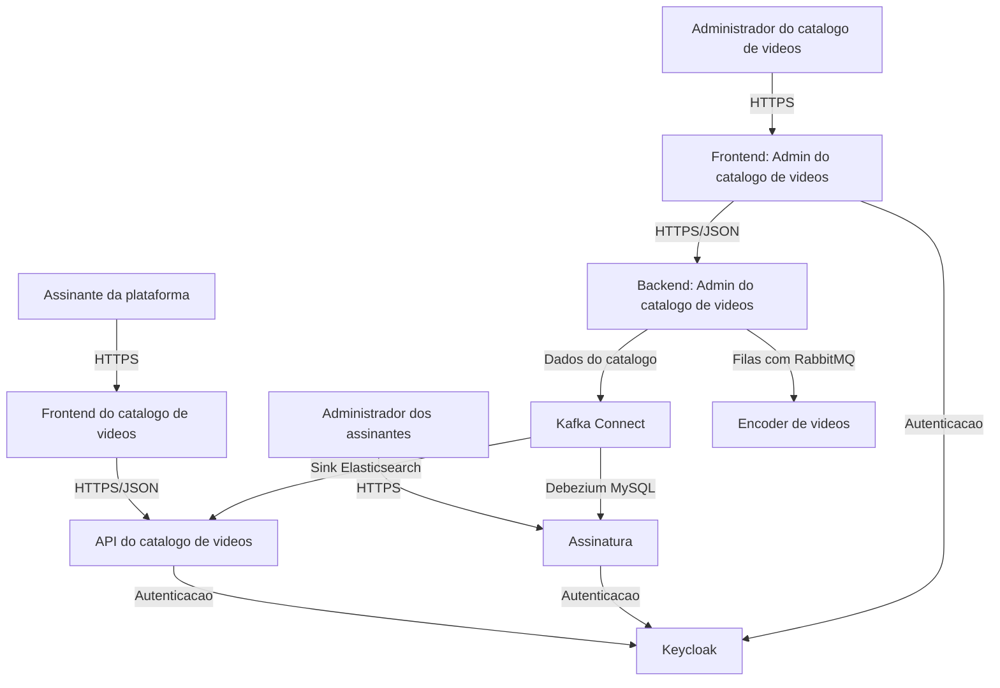

# Codeflix Catalog API

API do catalogo de videos da plataforma Codeflix, desenvolvida como parte do projeto pratico do curso Full Cycle. O projeto representa o backend administrativo responsavel por gerenciar o catalogo de conteudos, incluindo categorias, generos e videos, seguindo os principios de Clean Architecture para manter as regras de negocio independentes de frameworks, banco de dados e mecanismos de entrega.

## Visao geral

A imagem de referencia apresenta um diagrama C4 de contexto para o ecossistema Codeflix. Nesse contexto, a plataforma e composta por usuarios assinantes, administradores de assinatura, administradores do catalogo e servicos especializados que se comunicam por HTTPS, JSON, mensageria e replicacao de dados.

Este repositorio corresponde ao **Backend: Admin do Catalogo de Videos**, um dos sistemas centrais do dominio de catalogo. Ele e responsavel por expor as capacidades administrativas do catalogo e por manter as regras de negocio isoladas em um nucleo de dominio.



## Responsabilidade do projeto

O objetivo principal desta API e oferecer uma base robusta para administracao do catalogo de videos da Codeflix. A partir dela, o administrador podera evoluir fluxos como:

- Cadastro, edicao, ativacao e inativacao de categorias.
- Organizacao do catalogo por generos e categorias.
- Gerenciamento administrativo de videos.
- Integracao futura com servicos de encoding por filas.
- Publicacao ou replicacao de dados do catalogo para outros sistemas da plataforma.

## Clean Architecture

O projeto esta sendo construido com Clean Architecture. A proposta e proteger o dominio da aplicacao contra detalhes externos, mantendo as regras de negocio no centro da solucao.

A estrutura inicial ja evidencia essa separacao:

```text
src/
└── Core/
    ├── Domain/
    │   ├── Entity/
    │   ├── Repository/
    │   ├── Resolver/
    │   ├── Trait/
    │   └── Validation/
    ├── Enum/
    └── Exception/
```

### Principios aplicados

- **Dominio independente**: entidades e validacoes vivem em `src/Core` e nao dependem diretamente do Laravel.
- **Regras de negocio no centro**: comportamentos como ativar, desativar e atualizar uma categoria pertencem a entidade de dominio.
- **Contratos antes de implementacoes**: interfaces de repositorio definem dependencias esperadas pelo dominio.
- **Framework como detalhe**: Laravel atua como mecanismo de entrega, configuracao e infraestrutura.
- **Testabilidade**: o nucleo de dominio pode ser testado com PHPUnit sem depender de banco, HTTP ou containers.

## Stack

- PHP 8.4
- Laravel 13
- PHPUnit 12
- Laravel Pint
- Laravel Boost
- MySQL 8.4
- Docker e Nginx

## Como executar

Instale as dependencias e prepare o ambiente:

```bash
composer install
cp .env.example .env
php artisan key:generate
```

Com Docker:

```bash
docker compose up -d
```

Sem Docker, usando o ambiente local:

```bash
php artisan serve
```

## Qualidade e testes

Execute os testes automatizados:

```bash
php artisan test --compact
```

Formate o codigo PHP com Laravel Pint:

```bash
vendor/bin/pint --format agent
```

## Status atual

O projeto esta em desenvolvimento. A base atual concentra-se no nucleo de dominio do catalogo, com a entidade `CategoryEntity`, validacoes de dominio, resolucao de UUID e contrato de repositorio. As proximas evolucoes naturais sao as camadas de aplicacao, infraestrutura, persistencia e entrega HTTP da API administrativa.
