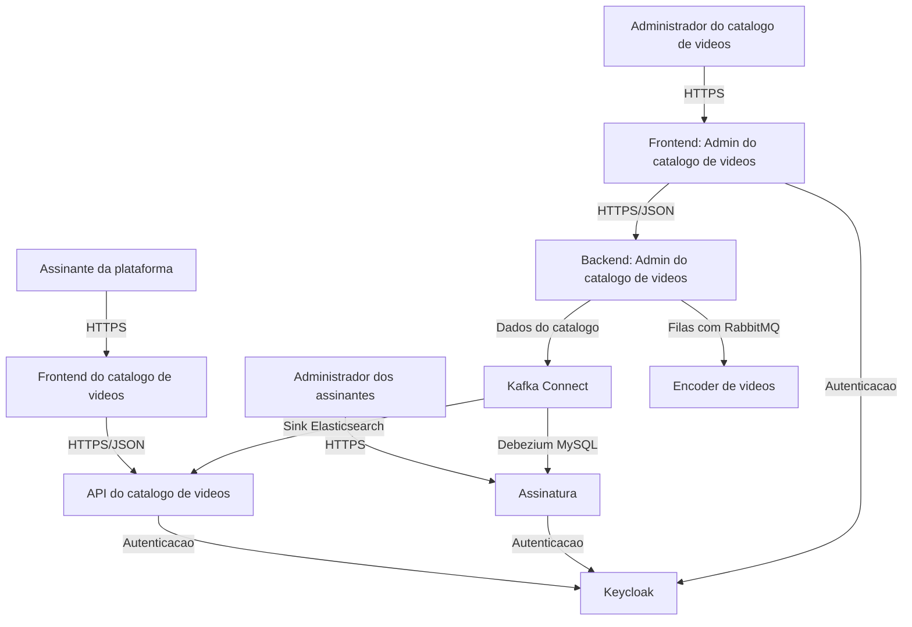

# Codeflix Catalog API

API do catalogo de videos da plataforma Codeflix, desenvolvida como parte dos estudos do curso Full Cycle. O projeto representa o backend administrativo responsavel por organizar o catalogo de conteudos e esta sendo construido com Laravel e Clean Architecture, mantendo as regras de negocio isoladas dos detalhes de framework, banco de dados e entrega HTTP.

## Visao geral

Este repositorio corresponde ao **Backend: Admin do catalogo de videos** dentro do ecossistema Codeflix. A ideia e oferecer a base administrativa que permite manter categorias, generos e videos, alem de preparar integracoes com servicos como encoder, autenticacao e replicacao de dados para a API publica do catalogo.

No estado atual, o desenvolvimento esta concentrado no modulo de **categorias**, com dominio, casos de uso, persistencia via Eloquent, migracao, factory, seeder e testes automatizados.



## Funcionalidades implementadas

### Categorias

- Criacao de categorias com UUID, nome, descricao e status ativo/inativo.
- Validacao de dominio para nome obrigatorio, tamanho minimo e maximo, e descricao opcional com limite de tamanho.
- Atualizacao de nome e descricao da categoria.
- Ativacao e desativacao da categoria pela entidade de dominio.
- Remocao logica com `deleted_at` usando soft delete.
- Busca de categoria por ID.
- Listagem de categorias com filtro por nome e ordenacao.
- Paginacao de categorias no contrato de repositorio.
- Tratamento de categoria inexistente com excecao de dominio.
- Conversao entre model Eloquent e entidade de dominio.
- Persistencia em MySQL por meio do model `Category` e repositores Eloquent.
- Factory e seeder para popular categorias no banco.

### Camada de aplicacao

- DTOs de entrada e saida para criacao, atualizacao, listagem e remocao de categorias.
- Casos de uso para criar, listar, atualizar e remover categorias.
- Interfaces para os casos de uso, permitindo inversao de dependencia.
- Service Provider dedicado para vincular contratos a implementacoes no container do Laravel.

### Testes

- Testes unitarios da entidade `CategoryEntity`.
- Testes dos casos de uso de criacao, listagem, atualizacao e remocao.
- Testes dos repositorios Eloquent para criar, buscar, listar, atualizar e remover categorias.
- Cobertura de fluxos felizes e cenarios de erro, como categoria inexistente.

## Arquitetura

O projeto segue Clean Architecture para manter o dominio independente de Laravel e de detalhes de infraestrutura. O Laravel entra como mecanismo de configuracao, container, banco de dados, migrations e futura camada HTTP.

```text
src/
└── Core/
    ├── Application/
    │   ├── DTO/
    │   └── Usecase/
    ├── Domain/
    │   ├── Entity/
    │   ├── Repository/
    │   ├── Resolver/
    │   ├── Trait/
    │   └── Validation/
    ├── Enum/
    ├── Exception/
    └── Infra/
        ├── Provider/
        └── Repository/
```

Principios aplicados:

- **Dominio independente**: entidades, validacoes e contratos ficam em `src/Core`.
- **Casos de uso explicitos**: a camada de aplicacao orquestra as operacoes do dominio.
- **Contratos antes de implementacoes**: usecases dependem de interfaces de repositorio.
- **Infraestrutura isolada**: Eloquent fica na camada `Infra`, adaptando o banco ao dominio.
- **Testabilidade**: regras de negocio e persistencia sao verificadas por PHPUnit.

## Stack

- PHP 8.4
- Laravel 13
- Laravel Sanctum
- Laravel Boost
- PHPUnit 12
- Laravel Pint
- MySQL 8.4
- Docker e Nginx
- Tailwind CSS 4

## Como executar

Instale as dependencias e prepare o ambiente:

```bash
composer install
cp .env.example .env
php artisan key:generate
```

Suba o ambiente com Docker:

```bash
docker compose up -d
```

Execute as migrations e seeders, se necessario:

```bash
php artisan migrate --seed
```

Tambem e possivel iniciar o servidor localmente:

```bash
php artisan serve
```

## Qualidade e testes

Execute a suite de testes:

```bash
php artisan test --compact
```

Formate o codigo PHP com Laravel Pint:

```bash
vendor/bin/pint --format agent
```

## Status atual

O projeto ainda esta em desenvolvimento. A base de categorias ja possui dominio, casos de uso, contratos, implementacao Eloquent e testes, mas os endpoints HTTP administrativos ainda nao foram implementados.

Proximas evolucoes naturais:

- Expor endpoints REST para categorias.
- Criar Form Requests, Resources e Controllers da API administrativa.
- Evoluir os modulos de generos e videos.
- Adicionar autenticacao/autorizacao para o admin do catalogo.
- Preparar integracoes futuras com encoder, filas e replicacao de dados.
